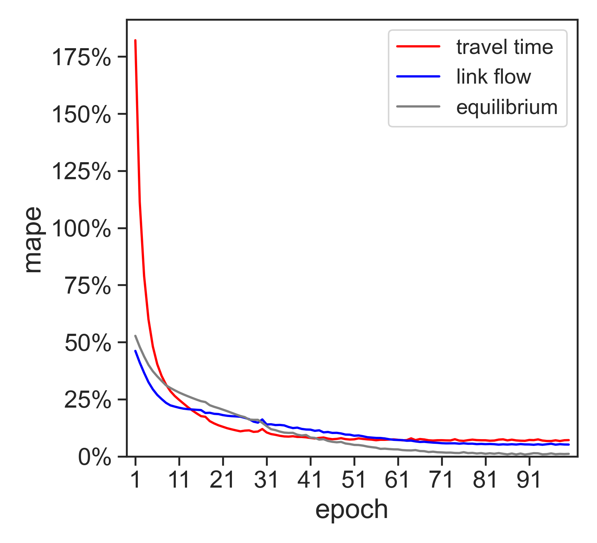
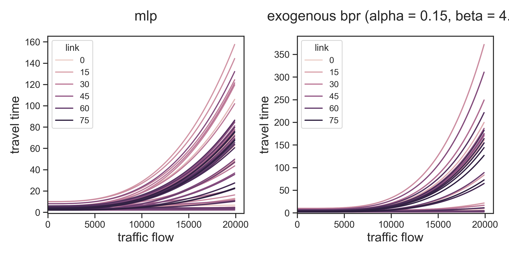

Macroscopic Traffic Estimation (MaTE)
==============================================================================

``MaTE`` is a data-driven macroscopic model for estimating traffic flow and travel times across entire networks using data-driven macroscopic. ``MaTE`` leverages large-scale traffic data to offer accurate, wide-range predictions, making it ideal for urban planning, traffic management, and transportation analysis. This problem is critical in transportation planning applications where the sensor coverage is low and the planned interventions have network-wide impacts. 

``MaTE`` is trained using automatic differentiation tools from Tensorflow. It also incorporates a neural network in one of the layers to enrich 
the mapping of traffic flows into travel times, namely, the performance functions. The input data consists of link characteristics, such as the maximum capacity (flow/hour) and the free flow speed or travel time. 
The training data are primarily traffic counts and travel time measurements collected at the link level and different hourly periods, which do not need to be available in every link and time period. 

The following two diagrams summarize our modeling framework:

### Model architecture

### Validation and model selection strategy

## Preprint
=================

To understand the theory behind the algorithms and the use cases of this codebase, a link with a preprint will be added soon. 

## Development Setup
=================

1. Clone this repository.
2. Download and install Anaconda: https://docs.anaconda.com/anaconda/install/index.html
3. Create virtual environment and install dependencies: ``conda create -n mate``
4. Activate environment: ``conda activate mate``
5. Install dependencies: ``conda env update -f env/cpu-intel.yml``. Replace with ``env/cpu-linux.yml`` for linux based systems. 
   | You can also setup the enviroment with the yml files ``env/cpu-silicon.yml`` or
   | ``env/gpu-silicon.yml`` to train models with cpu and gpu in Apple Silicon, respectively.

This repository is currently compatible with Python 3.10.x. 

## Examples

The folder ``examples/notebooks`` contains Jupyter notebooks with code demonstrations that can be reproduced from your local environment. If you are using VS Code, please make sure to select the ``mate`` environment as your kernel to run each notebook.

## Visualizations

### Experiments

#### Model training

  

#### Performance functions
  

#### Origin-demand estimation

### Large-scale deployment

#### Model training

  

#### Performance functions
  

#### Parameter estimation

   

#### Prediction of network-wide traffic congestion

 
 

<!--  -->

## Collaboration
=============

For any questions or interest in collaborating on this project, please open an issue in this repository. This package was developed under the guidance of Prof. Sean Qian. 

## 🌟 Loved the Project? Give Us a Star!
=============

We're thrilled to see you here! If you find this codebase useful for your project or it has been a helpful resource, please consider giving it a star. 🌟 Your support means a lot and it also helps others discover our work.